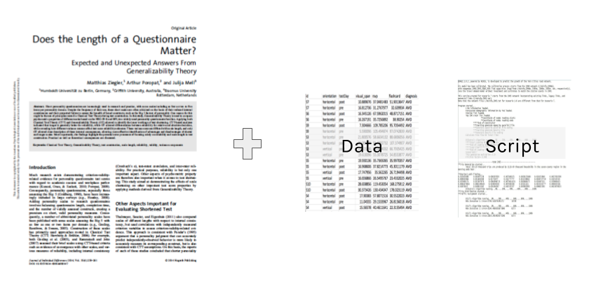
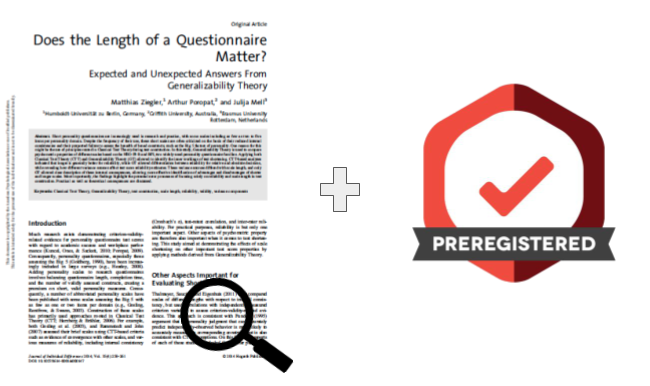

# Using R Reproducibly 


\
\
\

Most scientific work is **iterative**

<center>
<div class="image">

<div>source: [Wickham & Grolemund: R for Data Science](http://r4ds.had.co.nz/) </div>
</div>
</center>
\


The process between input and output needs to be **transparent** and **repeatable**. 

\
\
\


## Types of Reproducibility

Concerns about a "replication crisis", an inability to reproduce many published research results, has been a forefront concern in many fields, inclduing [biomedicine](http://www.slate.com/articles/health_and_science/future_tense/2016/04/biomedicine_facing_a_worse_replication_crisis_than_the_one_plaguing_psychology.html) and [psychology](https://www.nature.com/news/over-half-of-psychology-studies-fail-reproducibility-test-1.18248). Given the diversity of research involved, concepts of "reproducibility" can look very different in different fields. Scholars such as [Victoria Stodden](http://bulletin.imstat.org/2013/11/resolving-irreproducibility-in-empirical-and-computational-research/) and Brian Nosek, who leads the [Center for Open Science](https://cos.io/), distinguish between several types of reproducibility: 

\
**Computational Reproducibility:** Given the author's data and statistical code, can someone produce the same results?  
<center>
<div class="image">

</div>
</center>


\
\
**Empirical Reproducibility:** Is there enough information communicated about the study (e.g., design, experimental procedure, exclusion criterias, etc) for another researcher to repeat it in the exact same way?  
<center>
<div class="image">

</div>
</center>


\
\
**Statistical Reproducibility:** Is adequate information provided about the choice of statistical tests, threshold values, corrections, and a priori hypotheses to protect against statistical biases (such as ["p-hacking"](http://journals.plos.org/plosbiology/article?id=10.1371/journal.pbio.1002106))?  
<center>
<div class="image">

</div>
</center>

\
\

**Replicability:** If someone re-runs the study with the same methods and analysis, collecting new data, do they get the same results? 


<center>
<div class="image">

</div>
</center>


## General Principles of Reproducibility

### Don't do things by hand


<center>
<div class="image">

</div>
</center>

Everything that happens between the raw data and final output should be captured in the script. Point and click edits can't be tracked, and it may be impossible to reverse any errors (rounding, copy/paste, overwriting). 

It can also be time consuming to re-do "by hand" edits. 


### Automate where you can

Repetitive tasks are prone to errors (and are inefficient).

As a programmatic language, R is useful for many automation tasks.

* **File manipulation** *file.create(), dir.create(), list.files(), file.copy(), write()*
* **Looped processing** *for(), while()*
* **Vectorized functions** *apply(), lappy(), Vectorize()*

\
For example, our lab had an ocsilloscope that collected data in around 100 separate .wav files. Before analysis, we needed to downsample, cut the time to the first five seconds, and remove the baseline each of the collected files.  

You could do this by opening each of the 100 files one at a time in an audio program, doing all the steps, and resaving (not so fun!).  

Or, automate with a few lines of R code:

```{r, eval=FALSE}
library(tuneR)
setwd("~/Documents/wav_files")
for (i in list.files()) {
  wavdata <- readWave(paste0(getwd(), "/", i), header=F)
  #take correct channel
  wavdata <- ts(attr(wavdata, "left"), deltat=(1/64000))
  #downsample
  wavdata <- downsample(wavdata, samp.rate = 2004)
  #cut file
  wavdata <- window(wavdata,start=1, end=5)
  #Take out the moving baseline with a spline
  wavdata <- smooth.spline(x=wavdata, nknots=100)
  
  #save processed file
  save(wavdata, file=paste0(gsub(".wav", "", i), "_processed", ".Rdata"))
}  

```  
  
\


### Use Version Control

<center>
<div class="image">

</div>
</center>

In addition to using tools such as Git and Github, think about how you will identify milestone versions of a project. 

\

Can you easily identify which version of your code and data was used for your submitted article? The revised article? A related conference presentation? 

### Document your environment

<center>
<div class="image">

<div>source: [tlvincent, Rbloggers; Data: CRAN archive
](https://www.r-bloggers.com/analyzing-package-dependencies-and-download-logs-from-rstudio-and-a-start-towards-building-an-r-recommendation-engine/) </div>
</div>
</center>


The open source nature of R is part of what makes it a powerful tool for reproducible research, but it can also be part of the challenge. Although many packages allow backwards compatibility, not all do, and code run with one version of a package may not run (or worse, produce different results) than another. 

\

To ensure your code can be run in long after your current laptop is functioning, documentation is key. At a minimum, think about documenting:

* **Infrastructure** What software and hardware are you using to run your code?
* **Packages** What version of packages are used in your code?
* **Workflow** How did your data get to this script, where is it going?
* **Functional requirements** What is your script supposed to do 


\
\

Capturing your session info does a lot of this for you: 
```{r}
sessionInfo()
```


### Document your analysis

While code is technically "self-documenting", it doesn't always make sense to another user (or yourself six months after you wrote it!). Comment code heavily, including instructions on the order different scripts or steps should be executed. 

```{r, eval=FALSE}
#Comment

#Comment

#Comment!

```

Using a "literate programming" tool like R Markdown that combines analysis and interpretation can make it easy to document your analysis as you go. 


### Make your data open

One essential part of reproducibility is that your code (and data, where appropriate) are made available for verification or reuse. Many grants or journals may also require you to make your data and code available. 

\
\


There are many options for sharing:


**Github** 

If you are a student, faculty, or staff at the University of Minnesota, you have access to two versions of Github:

<center>
<div class="image">

</div>
</center>


Pros of sharing with github:

* Version control/backup
* Easy to "open up" a private repo
* Great for reuse or contribution from others


Cons of github:

* Clunky to point users to past milestone versions
* Limited project metadata (indexing, searchability)
* No formal archival actions


**Data & Archival Repositories**


DRUM - think about milestone versions and citation of data

Privacy - not all data can be shared, but it's not black and white. IRB, de-identification, licenses, etc.  


## Starting a Reproducible Workflow in R

### Organization 
* Start with an R projects, open .Rproj file - working directory, git and github add ons
* Mindful file names & directory organization - use relative paths in your scripts (folders for raw data, for scripts, for plots, for reports, etc)

### Anantomy of a script
* Order matters in a script
* Start with metadata - helps you quickly identify what the script does without pouring through the code. 

```{r, eval=FALSE}
##########################################
## Analysis Script for Project A
##   2017-09-01
##
##  Script takes in "A_processed_data.csv"
##  Creates Tables 1-4, Figures 1, 2 for submission to
##    Journal of Cool Results
#########################################
```


Load all packages you use first

Set working directory at start. If you do this through RStudio's interface, copy the generated syntax into your script. 

Load all data at start of file. Again, if you are loading through the interface windows, copy the syntax generated in the console. 


\
\
Section off analyses (example in R Studio)

Use lots of white space - it's free

Comment extensively

\
\

Try to make your code human friendly (example of dplyr versus base R), sections

Sensible names for data objects and variables

Set seed when doing any random number generation

If you save any outputs, make sure they are done by your script. ggsave(), png(), pdf()

\
\


Consider using multiple scripts for distinct parts of your analysis

* Various processing/data cleaning steps?
* Distinct analyses? 

If using multiple scripts, document the order in which the scripts should be executed. Starting the file names with the numeric order ("1_Data_Cleaning.R", "2_MixedAnalysis.R")

Always include session info at the end. 

Consider using a package dependency manager like packrat. 
[insert packrat illustration]

[insert screenshot of packrat options in R project]

Start clean every time. 
 * Do not save R workspace - set global options to prevent
 * Make sure your script runs in order. clear your envionment and console to test this. 
 
 [include relevant screenshots]


### Documentation
* Document each command with human readable comments (Markdown is a great way to do this); include metadata at top of file so you know what each script is doing
* Use white space in your scripts (it's free)
* 

### Transparency
* IF you point and click in RStudio, always PASTE command into script
* Load all necessary data and libraries at the very begining of your script, pacman
* Use relative paths - reference working directory, rather than the long computer path
* Set seed when doing any random number generation
* Do not save your Workspace! Tell R not to ask you. 
* Clear console/environment/restart R often to check yourself
* If you save any outputs, make sure they are done by your script. ggsave(), png(), pdf()

### Openness & Long-Term Preservation
* Consider using packrat for package dependecy management
* Share your data and code as widely as possible - github, CRAN, archival repositories 


