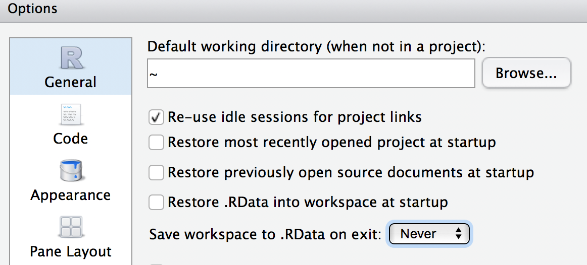

# Using R Reproducibly 

*Author: Alicia Hofelich Mohr*

\
\
\

Most scientific work is **iterative**

<center>
<div class="image">

<div>source: [Wickham & Grolemund: R for Data Science](http://r4ds.had.co.nz/) </div>
</div>
</center>
\


The process between input and output needs to be **transparent** and **repeatable**. 

\
\
\


## Types of Reproducibility

Many fields, most noteably [biomedicine](http://www.slate.com/articles/health_and_science/future_tense/2016/04/biomedicine_facing_a_worse_replication_crisis_than_the_one_plaguing_psychology.html) and [psychology](https://www.nature.com/news/over-half-of-psychology-studies-fail-reproducibility-test-1.18248), have been undergoing a **replication crisis** - a name given to the finding that many published research results can not be reproduced. 

But what is meant by "reproducible"? Given the diversity of disciplines involved, not everyone uses the term in the same way. Scholars such as [Victoria Stodden](http://bulletin.imstat.org/2013/11/resolving-irreproducibility-in-empirical-and-computational-research/) and Brian Nosek, who leads the [Center for Open Science](https://cos.io/), distinguish between several types of reproducibility: 

\
**Computational Reproducibility:** Given the author's data and statistical code, can someone produce the same results?  
<center>
<div class="image">

</div>
</center>


\
\
**Empirical Reproducibility:** Is there enough information communicated about the study (e.g., design, experimental procedure, exclusion criteria, etc) for another researcher to repeat it in the exact same way?  
<center>
<div class="image">

</div>
</center>


\
\
**Statistical Reproducibility:** Is adequate information provided about the choice of statistical tests, threshold values, corrections, and a priori hypotheses to protect against statistical biases (such as ["p-hacking"](http://journals.plos.org/plosbiology/article?id=10.1371/journal.pbio.1002106))?  
<center>
<div class="image">

</div>
</center>

\
\

**Replicability:** If someone re-runs the study with the same methods and analysis, collecting new data, do they get the same results? 


<center>
<div class="image">

</div>
</center>


## General Principles of Reproducibility

### Don't do things by hand


<center>
<div class="image">

</div>
</center>

Everything that happens between the raw data and final output should be captured in the script. Point and click edits can't be tracked, and it may be impossible to reverse any errors (rounding, copy/paste, overwriting). 

It can also be time consuming to re-do "by hand" edits. 


### Automate where you can

Repetitive tasks are prone to errors (and are inefficient).

As a programmatic language, R is useful for many automation tasks.

* **File manipulation** *file.create(), dir.create(), list.files(), file.copy(), write()*
* **Looped processing** *for(), while()*
* **Vectorized functions** *apply(), lappy(), Vectorize()*

\
For example, our lab had an oscilloscope that collected data in around 100 separate .wav files. Before analysis, we needed to down sample, cut the time to the first five seconds, and remove the baseline each of the collected files.  

You could do this by opening each of the 100 files one at a time in an audio program, doing all the steps, and resaving (not so fun!).  

Or, automate with a few lines of R code:

```{r, eval=FALSE}
library(tuneR)
setwd("~/Documents/wav_files")
for (i in list.files()) {
  wavdata <- readWave(paste0(getwd(), "/", i), header=F)
  #take correct channel
  wavdata <- ts(attr(wavdata, "left"), deltat=(1/64000))
  #downsample
  wavdata <- downsample(wavdata, samp.rate = 2004)
  #cut file
  wavdata <- window(wavdata,start=1, end=5)
  #Take out the moving baseline with a spline
  wavdata <- smooth.spline(x=wavdata, nknots=100)
  
  #save processed file
  save(wavdata, file=paste0(gsub(".wav", "", i), "_processed", ".Rdata"))
}  

```  
  
\


### Use Version Control

<center>
<div class="image">

</div>
</center>

In addition to using tools such as Git and Github, think about how you will identify milestone versions of a project. 

\

Can you easily identify which version of your code and data was used for your submitted article? The revised article? A related conference presentation? 

### Document your environment

<center>
<div class="image">

<div>source: [tlvincent, Rbloggers; Data: CRAN archive
](https://www.r-bloggers.com/analyzing-package-dependencies-and-download-logs-from-rstudio-and-a-start-towards-building-an-r-recommendation-engine/) </div>
</div>
</center>


The open source nature of R is what makes it a powerful tool for reproducible research, but it can also be part of the challenge. Although many packages allow backwards compatibility, not all do, and code run with one version of a package may not run (or worse, produce different results) than another. 

\

To ensure your code can be run in long after your current laptop is functioning, documentation is key. At a minimum, think about documenting:

* **Infrastructure** What software and hardware are you using to run your code?
* **Packages** What version of packages are used in your code?
* **Workflow** How did your data get to this script, where is it going?
* **Functional requirements** What is your script supposed to do? 


\
\

Capturing your session info does a lot of this for you: 
```{r}
sessionInfo()
```


### Document your analysis

While code is technically "self-documenting", it doesn't always make sense to another user (or yourself six months after you wrote it!). Comment code heavily, including instructions on the order different scripts should be executed. 

```{r, eval=FALSE}
#Comment

#Comment

#Comment!

```

Using a "literate programming" tool, such as R Markdown, that combines analysis and interpretation can make it easy to document your analysis as you go. 


### Make your data open

One essential part of reproducibility is that your code (and data, where appropriate) are made available for verification or reuse. Many grants or journals may also require you to make your data and code available. 


There are many options for sharing:


**Github** 

If you are a student, faculty, or staff at the University of Minnesota, you have access to two versions of Github:

<center>
<div class="image">

</div>
</center>


Pros of sharing with github:

* Version control/backup
* Easy to "open up" a private repo
* Great for reuse or contribution from others


Cons of github:

* Clunky to point users to past milestone versions
* Limited project metadata (indexing, searchability)
* No formal archival actions


**Data & Archival Repositories**

Data repositories are another option for sharing datasets and related documents, such as statistical code, procedures, or other supplemental material. These sites are specifically designed for hosting data, and many include services to make the data more findable, accessible, and preserved in the long-term. There are many different kinds of repositories for different kinds of data, and some journals or grants may require data to be shared in a specific repository 

<center>
<div class="image">

</div>
</center>


Pros of data repositories:

* Enhance findability (metadata, Google Scholar indexing)
* Data citations, Digital Object Identifiers (DOIs) for persistent access
* May offer curation and archival services
* Some manage access to data, allowing access to data that may not be suitable for public access

Cons of data repositories:

* Not every discipline has a dedicated repository
* Data services vary widely
* Can take a lot of work to prepare data for submission 


## Starting a Reproducible Workflow in R

Want to get started with a more reproducible workflow in R? Here are some quick tips and suggestions for using good [R style](http://adv-r.had.co.nz/Style.html)

### Organization 
Create an R project for the main folder for a research project. This will make it easy to add git and github to your project. 

<center>
<div class="image">

</div>
</center>


Use consistent directory organization in your project folder (e.g., separate folders for raw data, scripts, plots, reports), and reference the relative paths to these folders in your scripts.

\


Give files descriptive and meaningful names. Avoid special characters (/ , . # ?), spaces between words, or very lengthy file names. 


### Anantomy of a script

Order matters in a script; data used in an analysis needs to be loaded at an earlier point in the script. 

**At the beginning of the script:** 

Start with metadata (data about the script or dataset). This helps you quickly identify what the script does without pouring through the code. 

```{r, eval=FALSE}
##########################################
## Analysis Script for Project A
##   2017-09-01
##
##  Script takes in "A_processed_data.csv"
##  Creates Tables 1-4, Figures 1, 2 for submission to
##    Journal of Cool Results
#########################################
```

Load all packages you use in one spot. Consider using package management tools such as pacman or packrat.  

  * *pacman* Makes it easy to load required packages, and install any that are missing. Very useful when sending scripts to collaborators.  
```{r}
# "p_load" will load packages, installing any that are missing
pacman::p_load("ggplot2", "devtools", "dplyr")  
``` 
  
  * *packrat* Creates a project-specific library for packages, so that the same versions of packages used in the script stay packaged with the script.
```{r, eval=FALSE}
#Set up a private package library for a project
packrat::init("~/Documents/MyProject")
```

Set the working directory at start, and use relative file paths throughout. If you do this through RStudio's interface, copy the generated syntax into your script. 
```{r, eval=FALSE}
setwd("~/Documents/MyProject")
rawdata <- read.csv("raw_data/Myrawdatafile.csv")
```
Load all data in one spot. Again, if you are loading through the interface windows, copy the syntax generated in the console. 


\
\

**Throughout your script:**

Use sections in R Studio to organize and quickly navigate your code. Press cmd-shift-R on a Mac or cntrl-shift-R on a PC to insert a section. 

<center>
<div class="image">

</div>
</center>

\

Use lots of white space (it's free). Use spaces between arguments and between different lines of code.

```{r, eval=FALSE}
# Good
average <- mean(feet / 12 + inches, na.rm = TRUE)

# Bad
average<-mean(feet/12+inches,na.rm=TRUE)
```

\


Comment extensively. 
```{r, eval=FALSE}
#What does this do again?
x[i][[1]] <- do.call(rbind, y)
```

\

Use sensible names for data objects and variables. Keep it simple but meaningful. 
```{r, eval=FALSE}
# Good
day_one
day1

# Bad
first_day_of_the_month
DayOne
dayone
djm1
```

\

Set seed when doing any random number generations
```{r}
#take a random sample twice
sample(1:100, size=10)
sample(1:100, size=10)

#set seed before hand to ensure the random numbers are consistent
set.seed(seed=42)
sample(1:100, size=10)

set.seed(seed=42)
sample(1:100, size=10)

```

\

If you save any outputs, make sure they are done by your script. ggsave(), png(), pdf()
```{r, eval=FALSE}
# Base R: Creates "Figure1.png" in the working directory
png(file="Figure1.png")
ggplot(election, aes(x=winrep_2016)) + 
    geom_bar() +
    labs(x="Trump win", y="Number of counties")
dev.off()

#ggplot2: Creates "Figure1.png" in working directory
g <- ggplot(election, aes(x=winrep_2016)) + 
    geom_bar() +
    labs(x="Trump win", y="Number of counties")
ggsave(filename="Figure1.png", plot=g, device="png")
```
 


\
\

**At the end of your R session**


Do not save your "R workspace" at the end of your R sessions. The R workspace contains all the objects currently loaded in your R environment. Instead, your script should generate all the objects needed. You can set R options to ensure it does not get saved. 

<center>
<div class="image">

</div>
</center>

You can also clear your environment at any time with the broom icon in the Environment window. 

<center>
<div class="image">

</div>
</center>

Clear the console in RStudio with cntl-l. 


